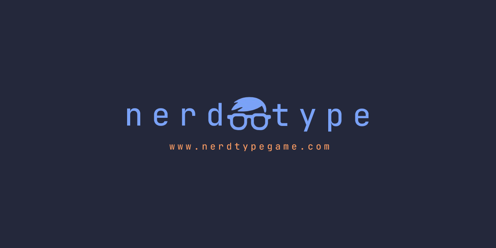

testing n8n workflow again, and one more time



[](#)
[](#)
[](#)
[](#)
[](#)
[](#)
[](#)
[](https://shields.io/)

# NerdType

A fast-paced, minimalistic typing game built with vanilla web technologies. Challenge yourself with multilingual vocabulary including programming terms, English, Finnish, and Swedish words. Features energy-based gameplay, multiple game modes, achievements system, and global leaderboards.

## Features

- **Multilingual Support** - English, Finnish, Swedish, Programming terms, and "Nightmare" mode
- **Multiple Game Modes** - Classic, Hard, Practice, Speedrunner, Zen, and Custom modes
- **Achievement System** - Comprehensive tracking with score, speed, gameplay style, and language-specific achievements
- **Real-time Gameplay** - Energy-based mechanics with dynamic countdown timers
- **In-game Commands** - Slash commands for quick settings changes without menu navigation
- **Global Leaderboards** - Optional competitive seasonal system with leaderboard resets
- **Responsive Design** - Mobile-optimized with device-specific adaptations
- **No Installation Required** - Pure client-side web application running in any modern browser
- **Minimalistic UI** - Clean, distraction-free interface with Bootstrap styling
- **Audio Feedback** - Optional keypress sounds for enhanced typing experience

## About This Project

NerdType serves as both a fully-functional typing game and a personal sandbox for learning and experimenting with new web technologies, testing patterns, and development practices.

## Development

This is a vanilla JavaScript project with no build system:

```bash
git clone https://github.com/merkksgit/nerd-type.git
cd nerd-type

# Run E2E tests
npm install
npm test
```

## Contact

- Email: nerdtype-contact@protonmail.com
- Contact Page: [Contact Form](https://www.nerdtypegame.com/pages/contact.html)
